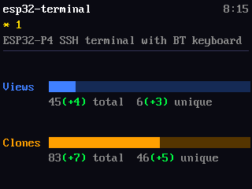

# display-sim

Native Linux/Windows desktop simulator for embedded display projects. Preview your firmware's UI in a live SDL2 window, save PNG screenshots, and interactively drag elements around to tune the layout — all without flashing hardware.

Works with any project that owns a framebuffer in memory: LCD, OLED, e-ink, monochrome, color, doesn't matter. ESP-IDF stubs are bundled because that's where it started, but they're optional and the same approach works for any embedded toolchain (STM32, RP2040, Zephyr, bare-metal) as long as you provide the equivalent shim headers.

&nbsp;

*Rendered from the sim, not the device — same renderer either way. From [esp32-gh-dashboard](https://github.com/dmatking/esp32-gh-dashboard), a project using display-sim for both desktop preview and layout editing.*

## How it works

Your project's display driver has two implementations:

| File | Used when |
|---|---|
| `display_hw.c` (or whatever you call it) | Building for the target — talks to real hardware |
| `display_sim.c` | Building for desktop — calls into display-sim |

The desktop build is a native CMake project that:
1. (Optionally) includes the bundled stub headers to shadow ESP-IDF / driver / FreeRTOS includes
2. Links SDL2 for the live preview window
3. Uses `stb_image_write` (vendored, header-only) for PNG output

The project's framebuffer is pointed to directly — no copy, no protocol change.

## Supported display formats

| `screencap_format_t` | Description | Common hardware |
|---|---|---|
| `SCREENCAP_MONO_PAGES` | 1-bpp, 8-rows-per-page | SH1107, SSD1306, SSD1309 |
| `SCREENCAP_RGB565` | 16-bpp packed, row-major | ST7789, ILI9341, ST7796, ST7703 |
| `SCREENCAP_RGB888` | 24-bpp, row-major | generic RGB framebuffer |

> **Note:** the C API uses a `screencap_` prefix throughout — that's the legacy name from when this repo was called `esp32-screencap`. Functionally the library is now `display-sim`, but the symbol prefix stays for API stability. A future major version may rename it.

## Dependencies

```
sudo apt install libsdl2-dev
```

No other runtime dependencies. PNG output uses vendored `stb_image_write.h`.

## Quick start

Clone as a submodule in your project:

```bash
git submodule add https://github.com/dmatking/display-sim.git sim/display-sim
```

Create `sim/CMakeLists.txt`:

```cmake
cmake_minimum_required(VERSION 3.16)
project(myproject_sim C)

include(display-sim/cmake/screencap.cmake)

screencap_add_sim(myproject_sim
    SOURCES
        main_sim.c          # your sim entry point
        display_sim.c       # calls screencap_init / screencap_flush
        ../main/game.c      # your existing app code (unchanged)
        ../main/render.c
    INCLUDES
        ../main             # your project's headers
)
```

Build:

```bash
mkdir sim/build && cd sim/build
cmake ..
make
./myproject_sim
```

## Keyboard shortcuts (SDL window)

| Key | Action |
|---|---|
| `P` | Save `screenshot_NNNN.png` (auto-increments) |
| `G` | Toggle a 10/50 px minor/major grid overlay (alignment aid) |
| `E` | Toggle layout edit mode (only if the project registered an editor — see below) |
| Click | Print board-space coords to stdout (or select an editor element if edit mode is on) |
| `Esc` / close | Quit |

## Layout editor (optional)

Projects with hand-positioned UI elements can register an editor session and drag elements around the live window. display-sim handles all the UI (selection, drag math, arrow-key nudge, save callback); the project owns the underlying coordinates.

```c
static screencap_elem_t elems[] = {
    { .id = "title",  .x = 4,  .y = 4,  .w = 256, .h = 16 },
    { .id = "score",  .x = 4,  .y = 28, .w = 64,  .h = 16 },
    /* … */
};

static void save_layout(const screencap_elem_t *e, int n, void *ctx)
{
    /* Write your positions back to source / a generated header. */
}

screencap_editor_register(elems, sizeof(elems)/sizeof(elems[0]),
                          save_layout, NULL /* reload */, NULL /* ctx */);
```

Once registered, the editor responds to:

| Key | Action |
|---|---|
| `E` | Toggle edit mode (highlights all rects, enables selection) |
| Click | Select the topmost element under the cursor |
| Drag | Move the selected element |
| Arrows | Nudge selected element by 1 px (Shift = 10 px) |
| `S` | Invoke the save callback |
| `R` | Invoke the reload callback |

Element rects are in **board-space pixels** (same coords as the framebuffer); display-sim handles the window-scale conversion. It writes the new x/y back into the array the project passes — call `screencap_editor_active()` if you need to know whether edit mode is on.

## Headless / CI mode

```bash
./myproject_sim --screenshot output.png
./myproject_sim --screenshot output.png --frames 60   # run 60 ticks first
./myproject_sim --screenshot output.png --grid        # bake grid overlay into the PNG
```

Returns exit code 0 on success. Can be run in a CI job with a virtual framebuffer (`Xvfb`) or headless SDL (`SDL_VIDEODRIVER=offscreen`).

## Writing a display_sim.c

```c
#include "display.h"
#include "screencap.h"

/* argc/argv forwarded from main_sim.c */
extern int   sim_argc;
extern char **sim_argv;

int display_init(display_t *dev)
{
    screencap_cfg_t cfg = {
        .width    = DISP_WIDTH,
        .height   = DISP_HEIGHT,
        .format   = SCREENCAP_RGB565,
        .scale    = 2,             /* window zoom factor */
        .title    = "My Project",
        .framebuf = dev->framebuf, /* point at your existing buffer */
    };
    return screencap_init(&cfg, sim_argc, sim_argv);
}

void display_flush(display_t *dev)
{
    (void)dev;
    screencap_flush();
}
```

Then in your sim main loop:

```c
while (screencap_poll()) {
    app_tick();          /* your existing logic */
    display_flush(&lcd);
    SDL_Delay(33);       /* ~30 fps */
}
screencap_destroy();
```

## ESP-IDF stub headers (optional)

If your project is built with ESP-IDF, bundled stub headers let you compile the firmware sources unchanged on desktop. Pass the include path to `screencap_add_sim` (the cmake helper does it automatically) and ESP-IDF code finds the right symbols:

| Header | What it stubs |
|---|---|
| `esp_err.h` | `esp_err_t`, `ESP_OK`, `ESP_FAIL` |
| `esp_log.h` | `ESP_LOGI/W/E/D/V` → `printf` |
| `esp_random.h` | `esp_random()` → `rand()` |
| `esp_timer.h` | `esp_timer_get_time()` → `clock_gettime` |
| `driver/i2c_master.h` | handle typedefs |
| `driver/spi_master.h` | handle typedefs, `SPI2_HOST`/`SPI3_HOST` |
| `driver/gpio.h` | `gpio_num_t` |
| `freertos/FreeRTOS.h` | `TickType_t`, `pdTRUE`, `pdMS_TO_TICKS` |
| `freertos/task.h` | `vTaskDelay()` → `usleep` |

For anything not listed (or for other toolchains entirely — STM32 HAL, Pico SDK, Zephyr, etc.), add a stub header to your project's `sim/` directory and include it before the `display-sim/` path — it will shadow the missing header.

## Examples

### Real project

**[esp32-gh-dashboard](https://github.com/dmatking/esp32-gh-dashboard)** is a complete GitHub traffic dashboard for five ESP32-family display boards (CYD 2.8", CYD-S3, CYD 3.5", Waveshare 2.0", Waveshare P4) that uses display-sim end-to-end:

- Desktop preview during firmware development (no flash cycle for layout iteration)
- PNG screenshots for the README, scripted out of the headless mode
- Grid overlay + click-for-coords during initial layout work
- The drag editor wired up to two layout structs (`layout_cyd_repo_t`, `layout_p4_repo_t`) — drag elements around in the sim, hit `S`, regenerated C source lands in the firmware on the next build
- GitHub Actions builds the firmware for all five boards on push to main

Browse [`sim/main_sim.c`](https://github.com/dmatking/esp32-gh-dashboard/blob/main/sim/main_sim.c), [`sim/layout_editor.c`](https://github.com/dmatking/esp32-gh-dashboard/blob/main/sim/layout_editor.c), and [`sim/CMakeLists.txt`](https://github.com/dmatking/esp32-gh-dashboard/blob/main/sim/CMakeLists.txt) for a full integration.

### Standalone demos

| Example | Display | What it shows |
|---|---|---|
| [`examples/mono_sh1107/`](examples/mono_sh1107/) | SH1107 128×128 OLED | Bouncing ball, frame counter |
| [`examples/color_rgb565/`](examples/color_rgb565/) | Generic 240×240 RGB565 | Rainbow gradient, bouncing colored squares |

Build an example:

```bash
cd examples/mono_sh1107
mkdir build && cd build
cmake ..
make
./mono_sh1107_sim
```
